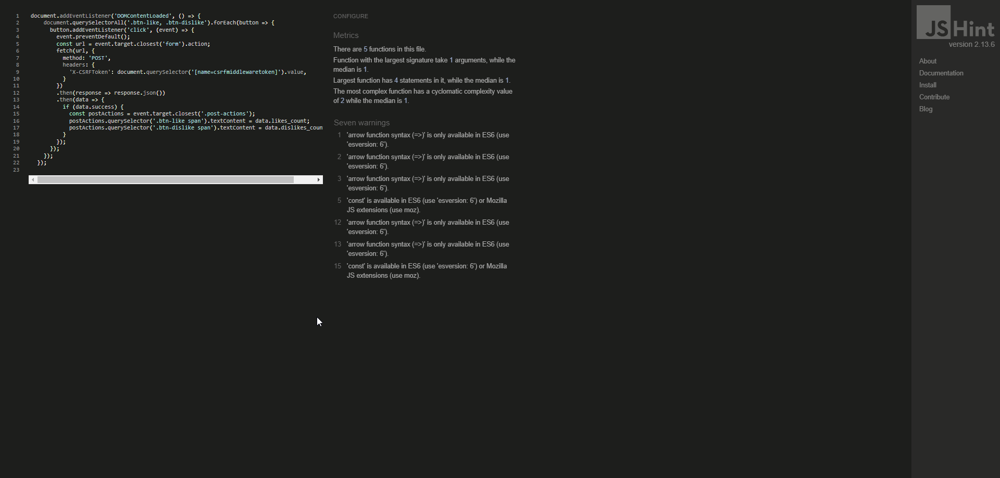
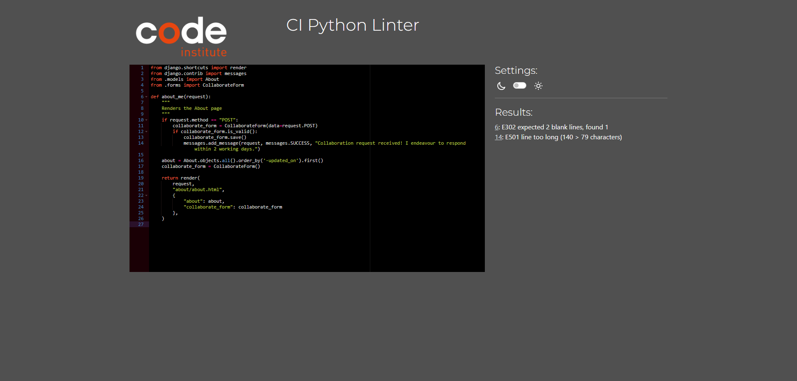

# PokeSmart

**Developer:** Callum Newman

## Live Website

[Link to live website](https://pokesmart-e83201be2611.herokuapp.com/)

## Purpose of the Project

Welcome to PokéSmart!

At PokéSmart, we aim to be more than just a hub for Pokémon news - although of course, our updates are always hot off the press! - we’re the center of the Poké community! Improve your game, stay up-to-date with the latest trends, and reach out to share your thoughts with the community.

## Table of Contents

- [User Experience (UX)](#user-experience-ux)
- [Key Project Goals](#key-project-goals)
- [Target Audience](#target-audience)
- [User Requirements and Expectations](#user-requirements-and-expectations)
- [Epics and User Stories](#epics-and-user-stories)
- [Features](#features)
- [Design](#design)
- [Database Schema](#database-schema)
- [Technology Used](#technology-used)
- [Testing](#testing)
- [User Testing](#user-testing)
- [Responsiveness](#responsiveness)
- [Bugs](#bugs)
- [Deployment](#deployment)

## User Experience (UX)

- **Purpose:** Share and discuss Pokémon-related blog posts, interact with content through comments, and manage user profiles.
- **Features:** Viewing posts, commenting, user profiles, light and dark mode implementation and community engagement.

## Key Project Goals

1. **To Share Pokémon Content:** Provide a space for users to view and discuss Pokémon-related blog posts.
2. **To Build a Community:** Foster interaction through comments, likes, dislikes, and user profiles.
3. **To Encourage User Interaction:** Allow users to comment, like, dislike and share posts and view their own profiles.
4. **To Provide a User-Friendly Experience:** Ensure easy navigation and accessibility across devices.

## Target Audience

- **Pokémon Fans:** Individuals interested in Pokémon and related content.
- **Blog Readers:** Users looking for engaging Pokémon-related blog posts.
- **Community Members:** Users who want to interact and share their thoughts about Pokémon.

## User Requirements and Expectations

- **Content Access:** Users expect to view detailed blog posts about Pokémon.
- **Interactive Features:** Users want to comment, like and share posts and manage their profiles.
- **Community Engagement:** Users anticipate interacting with other fans and sharing their own content - collaboartion is fostered through contact forms.

## Features

#### Navigation Bar

#### Blog Card

#### Comment Form

#### Comment History

#### Contact Us Form

#### Footer

#### Likes / Dislikes

#### Prev and Next Buttons

#### Share Posts

## Design

#### Colour Design

Use of vibrant colors related to Pokémon.

#### About Page

#### Blog Page

#### Contact Us Page

#### Second Page of Blogs

#### Post Comment Section

#### Profile Comment History

#### Signed In

#### Sign In

#### Sign Out

#### Sign Up Page

## Database Schema

#### About Content

#### Admin Home

#### Collaberation Requests

#### Comments

#### Posts

#### Recent Actions

#### Users

## Testing:

### HTML Validation

All HTML pages were tested with the [W3C HTML Validator](https://validator.w3.org/).

#### HTML Result

| page  | validator                                                                                          | result |
| ----- | -------------------------------------------------------------------------------------------------- | ------ |
| Home  | 

Home Page

   | PASS   |
| About | 

About Page

 | PASS   |

### CSS Validation

Custom CSS was put through the [W3C CSS Validator](https://jigsaw.w3.org/css-validator/).

#### CSS Result

| page | validator                                                                                        | result |
| ---- | ------------------------------------------------------------------------------------------------ | ------ |
| Css  | 

style.css

 | PASS   |

### JS Validation

JavaScript code in the comment.js and image.js file was put through the [JSHint Validator](https://jshint.com/).

#### JS Result

The js code for all files passed.

| page            | validator                                                                                             | result |
| --------------- | ----------------------------------------------------------------------------------------------------- | ------ |
| Comment.js      | 

style.css

    | PASS   |
| LikeDislikes.js | 

style.css

 | PASS   |
| Social.js       | 

style.css

      | PASS   |
| Theme.js        | 

style.css

       | PASS   |

### Python Validation

All python code was put through the [CI Python Linter](https://pep8ci.herokuapp.com/).

#### Python Result

| File             | Validator                                                                                               | Result |
| ---------------- | ------------------------------------------------------------------------------------------------------- | ------ |
| About admin      | 

About Models

       | PASS   |
| About apps       | 

About Views

         | PASS   |
| About model      | 

About Forms

       | PASS   |
| About urls       | 

About urls

          | PASS   |
| About views      | 

About Admin

        | PASS   |
| About forms      | 

Blog Models

        | PASS   |
| About test_forms | 

Blog Views

    | PASS   |
| About test_views | 

Blog Forms

    | PASS   |
| Blog Admin       | 

Blog urls

           | PASS   |
| Blog Apps        | 

Blog Admin

           | PASS   |
| Blog Forms       | 

Makeover Models

     | PASS   |
| Blog Models      | 

Makeover Views

     | PASS   |
| Blog test_forms  | 

Makeover Forms

 | PASS   |
| Blog test_views  | 

Makeover urls

  | PASS   |
| Blog urls        | 

Makeover Admin

       | PASS   |
| Blog view        | 

Settings

            | PASS   |

## User Testing:

Functionality Testing: Ensured all features work as expected, including comment submissions, profile management, and content viewing.

## Responsiveness:

All pages on the website were tested for responsiveness across multiple devices. All pages display correctly on all devices tested.

## Devices used for testing, OS and Browsers:

- iPhone 12, 13, 14
- Latest and Legacy Android Smartphones: Test on devices from manufacturers Samsung, Google. This includes models running the latest OS versions Android 12 & 13.
- Latest and Legacy iOS Devices: Include the latest and legacy handsets by Apple, iPhone X, iPhone 12 Mini, iPhone 13 Pro, and iPhone 14 Plus. This ensures testing on the latest iOS versions like iOS 15 and 16.
- Windows OS, windows 10 and windows 11 devices were used to test the website
- Mac OS, Mac os was tested using a MacBook air.
- Chrome
- Firefox
- Safari
- Edge
- Opera

## User Testing:

### Notifications and feedback testing for comments on all pages

| Action                                     | Notifications and feedback for comments             | Does it work as expected? |
| ------------------------------------------ | --------------------------------------------------- | ------------------------- |
| Logged out and looking at comments         | It should say "log in to leave a comment"           | PASS                      |
| Submit a comment                           | Comment submitted and awaiting approval             | PASS                      |
| Delete a comment                           | Your comment has been deleted successfully!         | PASS                      |
| Edit a comment modal                       | User is able to edit the comment in the body        | PASS                      |
| Comment text in box on click of edit       | Targeted text appears in comment box                | PASS                      |
| When edit button is clicked                | The word submit changes to update                   | PASS                      |
| Change mind about editing, can click reset | Resets update back to submit and clears comment box | PASS                      |
| Edit a comment successfully                | Comment Updated! Notification appears               | PASS                      |

### Notifications and feedback testing for register, signin and signout

| Action   | Notifications and feedback for signin and out | Does it work as expected? |
| -------- | --------------------------------------------- | ------------------------- |
| signin   | Successfully signed in as username.           | PASS                      |
| signout  | You have signed out.                          | PASS                      |
| register | Successfully signed in as username.           | PASS                      |

### Notification and feedback testing for about page

| Action                     | Notifications and feedback for signin and out | Does it work as expected? |
| -------------------------- | --------------------------------------------- | ------------------------- |
| Navigation menu links work | Successfully navigated to desired page.       | PASS                      |
| Contact button clicked     | Navigate to Contact form                      | PASS                      |
| Contact form completed     | User receives a success message               | PASS                      |

### Notification and feedback testing for social media links

| Action                     | Notifications and feedback for signin and out          | Does it work as expected? |
| -------------------------- | ------------------------------------------------------ | ------------------------- |
| Social media links clicked | Successfully navigated to desired page in a new window | PASS                      |

### Notifications and feedback testing for admin panel

| Action                                       | Notifications and feedback for comments         | Does it work as expected? |
| -------------------------------------------- | ----------------------------------------------- | ------------------------- |
| When contact request is marked in admin      | The request was changed successfully.           | PASS                      |
| When a comment has been approved in admin    | The comment "Comment" was changed successfully. | PASS                      |
| When a comment is deleted by admin           | Successfully deleted 1 comment.                 | PASS                      |
| When more than 1 comment is deleted by admin | Successfully deleted 2 comments.                | PASS                      |

## Deployment:

### Pre deployment

- To ensure successful deployment with Heroku, it's good practice to make sure that the requirements.txt file is kept up to date so as that imported python modules are configured correctly.
- A Procfile is required to allow Heroku deployment to be configured to a gunicorn web app.
- In settings.py configure the ALLOWED_HOSTS list the format ['app_name.heroku.com', 'localhost'], make sure all static files and directories are configured correctly.
- All environment variables on the env.py which gitignored on the repo must be configured correctly with the database url and secret key.

### Deploying with heroku

After account setup, the steps were as follows:

1.  Create a New App on Heroku:
    - Log into your Heroku account.
    - Click on "Create new app" and provide a unique name for your app.
    - Choose the region for your app (e.g., Europe).
    - Click "Create app".
2.  Connect to GitHub:
    - In the deployment method section, select GitHub.
    - Search for your GitHub repository and click "Connect".
3.  Configure Deployment Settings:
    - Choose between manual or automatic deployment. For automatic deployment, ensure the main branch is selected.
    - In the settings tab, reveal config vars and input the required hidden variables.
4.  Set Buildpacks:
    - Go to the settings tab and select "Buildpacks".
    - Add Node.js and Python as the buildpacks for your application.
5.  Deploy Your App: - Click "Deploy" to start the deployment process. - After the first deployment, you will receive a message indicating that your app was successfully deployed. - Use the "View" button to access your deployed application.
    This process leverages Heroku's integration with GitHub to automate the deployment of your application, making it easier to manage and update your project.

The live link for this project can be found here - [PokeSmart](https://pokesmart-e83201be2611.herokuapp.com/)

## Credits

### Code

[CI walkthrough I think therefore I blog](https://github.com/Code-Institute-Solutions/blog/tree/main/12_views_part_3/05_edit_delete) - The CI walkthrough repo was relied upon for the comment section, edit and delete button however I created custom models to suit the theme of the website.

## Technology Used

- **Languages and Frameworks:**
  - HTML5 for content and structure.
  - CSS for styling.
  - JavaScript for dynamic interactions.
  - Django for backend development.
- **Database:**
  - PostgreSQL for data storage.
- **Tools and Services:**
  - GitHub for version control and repository management.
  - Heroku for deployment.

### Technologies and tools:

- [GitHub](https://github.com/ "link to github webpage") was used to store the code files, README files and assets
- [Git](https://git-scm.com/ "link to official git website") was used as a version control software to commit and push the code to the GitHub repository
- [Heroku](https://id.heroku.com/login "link to Heroku login") was used to deploy the project
- [lucidcharts](https://www.lucidchart.com/pages/ "Link to lucidcharts") was used to make a diagram of the database schema and entity relationship diagrams.
- [Prettier](https://prettier.io/ "link to official prettier website") was used as the default formatter in Gitpod IDE, for html and css files.
- [Bootstrap](https://getbootstrap.com/ "link to official bootstrap website") was used to quickly layout, position and size critical website features
- [Google Fonts](https://fonts.google.com/ "link to official google fonts website") was used to import fonts
- [Font Awesome](https://fontawesome.com/ "link to official font awesome website") was used for all icons
- [Google Chrome Developer Tools](https://developer.chrome.com/docs/devtools/overview/ "Link to official chrome developer tools website") was used for lighthouse testing, debugging and consistently checking responsiveness
- [SourceTree](https://www.sourcetreeapp.com/ "Link to Official Sourcetree Website") was used instead of git terminal
- [W3C Markup Validator](https://validator.w3.org/ "link to official html validator") was used to validate all live html
- [Jigsaw CSS Validator](https://jigsaw.w3.org/css-validator/ "link to official css validator") was used to validate CSS code
- [JS Hint](https://jshint.com/ "link to official javascript validator") was used to validate JavaScript code
- [Code Institute Python Linter](https://pep8ci.herokuapp.com/ "link to official python validator") was used to validate all python code
- [Django Summernote](https://pypi.org/project/django-summernote/ "link to official summernote website") was used. This is a rich text editor plugin for Django
- [Django Crispy Forms](https://pypi.org/project/django-crispy-forms/ "link to official crispy forms website") were used throughout the project to quickly create forms

---
